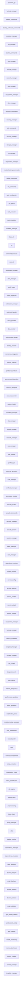

# TESSA Module Dependency Diagram

This diagram shows the dependencies between modules in TESSA.

```mermaid
flowchart LR
    id_proxmox_nli_api_proxmox_api[proxmox_api]
    id_proxmox_nli_commands_backup_backup_manager[backup_manager]
    id_proxmox_nli_commands_backup_commands[backup_commands]
    id_proxmox_nli_commands_backup_scheduler_commands[backup_scheduler_commands]
    id_proxmox_nli_commands_core_container_manager[container_manager]
    id_proxmox_nli_commands_core_vm_manager[vm_manager]
    id_proxmox_nli_commands_docker_commands[docker_commands]
    id_proxmox_nli_commands_network_dns_manager[dns_manager]
    id_proxmox_nli_commands_network_firewall_manager[firewall_manager]
    id_proxmox_nli_commands_network_network_manager[network_manager]
    id_proxmox_nli_commands_network_pxe_manager[pxe_manager]
    id_proxmox_nli_commands_network_ssh_device_manager[ssh_device_manager]
    id_proxmox_nli_commands_network_vlan_manager[vlan_manager]
    id_proxmox_nli_commands_proxmox_commands[proxmox_commands]
    id_proxmox_nli_commands_security_security_manager[security_manager]
    id_proxmox_nli_commands_ssh_commands[ssh_commands]
    id_proxmox_nli_commands_storage_backup_manager[backup_manager]
    id_proxmox_nli_commands_storage_storage_manager[storage_manager]
    id_proxmox_nli_commands_storage_zfs_manager[zfs_manager]
    id_proxmox_nli_commands_troubleshooting_diagnostics_manager[diagnostics_manager]
    id_proxmox_nli_commands_troubleshooting_commands[troubleshooting_commands]
    id_proxmox_nli_commands_update_command[update_command]
    id_proxmox_nli_commands_vm_command[vm_command]
    id_proxmox_nli_core_automation_auto_configurator[auto_configurator]
    id_proxmox_nli_core_automation_job_queue[job_queue]
    id_proxmox_nli_core_automation_task_executor[task_executor]
    id_proxmox_nli_core_automation_task_scheduler[task_scheduler]
    id_proxmox_nli_core_automation_workflow_manager[workflow_manager]
    id_proxmox_nli_core_base_nli[base_nli]
    id_proxmox_nli_core_cli[cli]
    id_proxmox_nli_core_command_executor[command_executor]
    id_proxmox_nli_core_core_nli[core_nli]
    id_proxmox_nli_core_dashboard_manager[dashboard_manager]
    id_proxmox_nli_core_events_alert_manager[alert_manager]
    id_proxmox_nli_core_events_audit_logger[audit_logger]
    id_proxmox_nli_core_events_event_dispatcher[event_dispatcher]
    id_proxmox_nli_core_events_notification_manager[notification_manager]
    id_proxmox_nli_core_events_webhook_handler[webhook_handler]
    id_proxmox_nli_core_integration_cloud_provider[cloud_provider]
    id_proxmox_nli_core_integration_dns_provider[dns_provider]
    id_proxmox_nli_core_integration_environment_merger[environment_merger]
    id_proxmox_nli_core_integration_identity_provider[identity_provider]
    id_proxmox_nli_core_integration_monitoring_integration[monitoring_integration]
    id_proxmox_nli_core_monitoring_metrics_collector[metrics_collector]
    id_proxmox_nli_core_monitoring_predictive_analyzer[predictive_analyzer]
    id_proxmox_nli_core_monitoring_prometheus_integration[prometheus_integration]
    id_proxmox_nli_core_monitoring_resource_analyzer[resource_analyzer]
    id_proxmox_nli_core_monitoring_resource_monitor[resource_monitor]
    id_proxmox_nli_core_monitoring_system_health[system_health]
    id_proxmox_nli_core_network_cloudflare_manager[cloudflare_manager]
    id_proxmox_nli_core_network_dns_manager[dns_manager]
    id_proxmox_nli_core_network_firewall_manager[firewall_manager]
    id_proxmox_nli_core_network_network_manager[network_manager]
    id_proxmox_nli_core_network_pxe_manager[pxe_manager]
    id_proxmox_nli_core_network_vlan_handler[vlan_handler]
    id_proxmox_nli_core_profile_sync[profile_sync]
    id_proxmox_nli_core_response_generator[response_generator]
    id_proxmox_nli_core_security_auth_manager[auth_manager]
    id_proxmox_nli_core_security_certificate_manager[certificate_manager]
    id_proxmox_nli_core_security_permission_handler[permission_handler]
    id_proxmox_nli_core_security_security_auditor[security_auditor]
    id_proxmox_nli_core_security_security_commands[security_commands]
    id_proxmox_nli_core_security_security_manager[security_manager]
    id_proxmox_nli_core_security_security_posture[security_posture]
    id_proxmox_nli_core_security_session_manager[session_manager]
    id_proxmox_nli_core_security_token_manager[token_manager]
    id_proxmox_nli_core_security_user_manager[user_manager]
    id_proxmox_nli_core_services_dependency_resolver[dependency_resolver]
    id_proxmox_nli_core_services_health_checker[health_checker]
    id_proxmox_nli_core_services_service_config[service_config]
    id_proxmox_nli_core_services_service_deployer[service_deployer]
    id_proxmox_nli_core_services_service_handler[service_handler]
    id_proxmox_nli_core_services_service_wizard[service_wizard]
    id_proxmox_nli_core_service_handler[service_handler]
    id_proxmox_nli_core_ssh_device_manager[ssh_device_manager]
    id_proxmox_nli_core_storage_backup_manager[backup_manager]
    id_proxmox_nli_core_storage_backup_scheduler[backup_scheduler]
    id_proxmox_nli_core_storage_snapshot_manager[snapshot_manager]
    id_proxmox_nli_core_storage_storage_manager[storage_manager]
    id_proxmox_nli_core_storage_zfs_handler[zfs_handler]
    id_proxmox_nli_core_troubleshooting_diagnostic_tools[diagnostic_tools]
    id_proxmox_nli_core_troubleshooting_log_analyzer[log_analyzer]
    id_proxmox_nli_core_troubleshooting_network_diagnostics[network_diagnostics]
    id_proxmox_nli_core_troubleshooting_performance_analyzer[performance_analyzer]
    id_proxmox_nli_core_troubleshooting_report_generator[report_generator]
    id_proxmox_nli_core_troubleshooting_self_healing_tools[self_healing_tools]
    id_proxmox_nli_core_troubleshooting_troubleshooting_assistant[troubleshooting_assistant]
    id_proxmox_nli_core_user_preferences[user_preferences]
    id_proxmox_nli_core_voice_handler[voice_handler]
    id_proxmox_nli_core_web[web]
    id_proxmox_nli_nlu_context_management[context_management]
    id_proxmox_nli_nlu_entity_extraction[entity_extraction]
    id_proxmox_nli_nlu_huggingface_client[huggingface_client]
    id_proxmox_nli_nlu_intent_identification[intent_identification]
    id_proxmox_nli_nlu_nlu_engine[nlu_engine]
    id_proxmox_nli_nlu_ollama_client[ollama_client]
    id_proxmox_nli_nlu_preprocessing[preprocessing]
    id_proxmox_nli_plugins_base_plugin[base_plugin]
    id_proxmox_nli_plugins_plugin_manager[plugin_manager]
    id_proxmox_nli_plugins_utils[utils]
    id_proxmox_nli_services_backup_handler[backup_handler]
    id_proxmox_nli_services_dependency_manager[dependency_manager]
    id_proxmox_nli_services_dependency_visualizer[dependency_visualizer]
    id_proxmox_nli_services_deployment_base_deployer[base_deployer]
    id_proxmox_nli_services_deployment_docker_deployer[docker_deployer]
    id_proxmox_nli_services_deployment_script_deployer[script_deployer]
    id_proxmox_nli_services_deployment_service_validator[service_validator]
    id_proxmox_nli_services_deployment_validators_docker_validator[docker_validator]
    id_proxmox_nli_services_deployment_validators_script_validator[script_validator]
    id_proxmox_nli_services_goal_based_catalog[goal_based_catalog]
    id_proxmox_nli_services_goal_based_setup[goal_based_setup]
    id_proxmox_nli_services_goal_mapper[goal_mapper]
    id_proxmox_nli_services_health_monitoring[health_monitoring]
    id_proxmox_nli_services_metrics_dashboard[metrics_dashboard]
    id_proxmox_nli_services_service_catalog[service_catalog]
    id_proxmox_nli_services_service_manager[service_manager]
    id_proxmox_nli_services_template_manager[template_manager]
```
