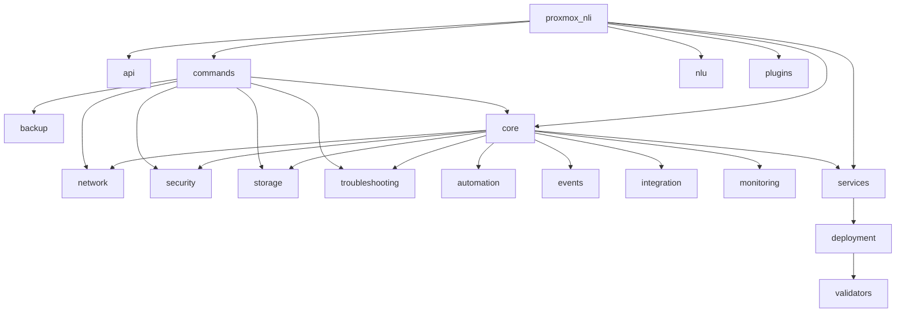

# TESSA Package Structure

This diagram shows the package structure of TESSA.

```mermaid
flowchart TD
    id_proxmox_nli[proxmox_nli]
    id_proxmox_nli --> id_api[api]
    id_proxmox_nli --> id_commands[commands]
    id_commands --> id_backup[backup]
    id_commands --> id_core[core]
    id_commands --> id_network[network]
    id_commands --> id_security[security]
    id_commands --> id_storage[storage]
    id_commands --> id_troubleshooting[troubleshooting]
    id_proxmox_nli --> id_core[core]
    id_core --> id_automation[automation]
    id_core --> id_events[events]
    id_core --> id_integration[integration]
    id_core --> id_monitoring[monitoring]
    id_core --> id_network[network]
    id_core --> id_security[security]
    id_core --> id_services[services]
    id_core --> id_storage[storage]
    id_core --> id_troubleshooting[troubleshooting]
    id_proxmox_nli --> id_nlu[nlu]
    id_proxmox_nli --> id_plugins[plugins]
    id_proxmox_nli --> id_services[services]
    id_services --> id_deployment[deployment]
    id_deployment --> id_validators[validators]
```
