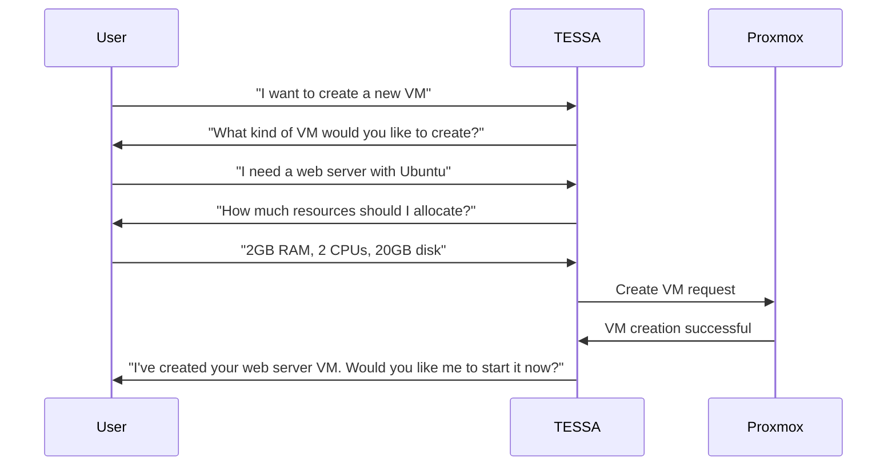
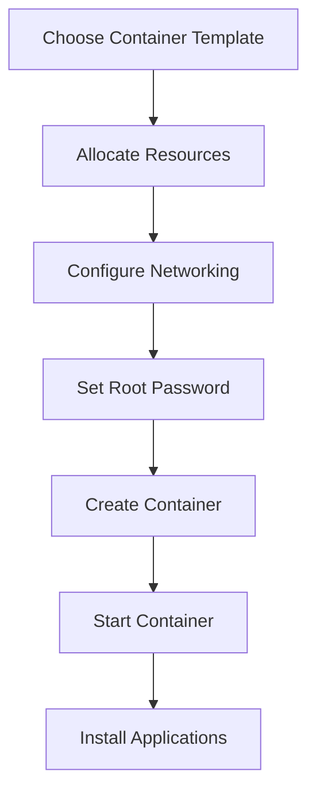
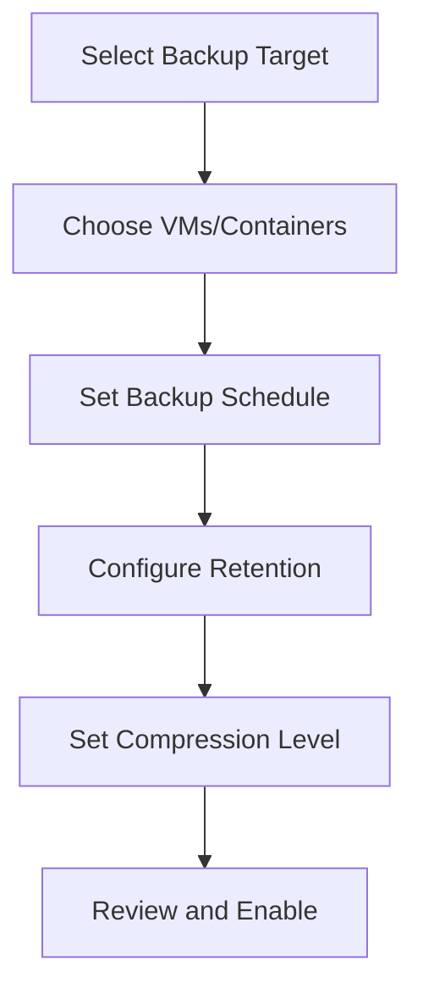
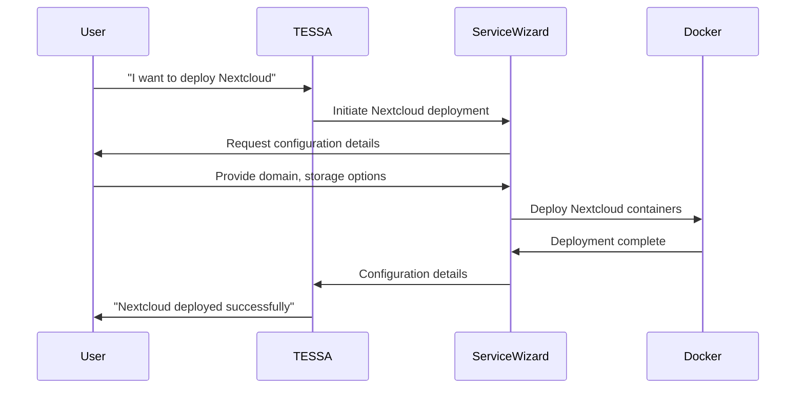
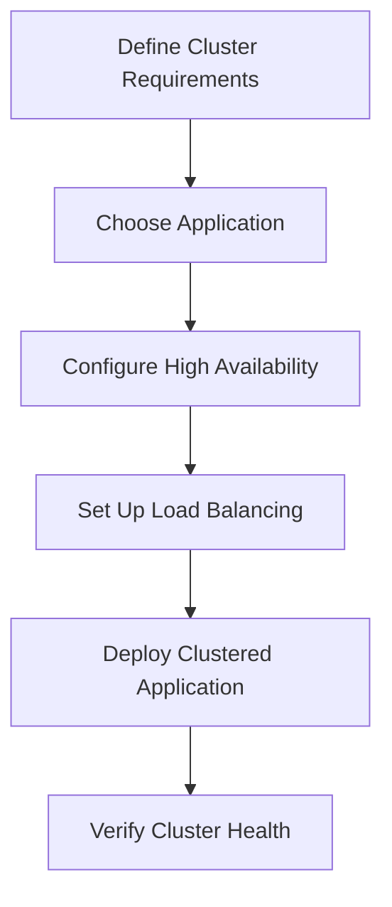

# Examples and Tutorials

## Overview

This document provides detailed examples and tutorials for using TESSA (The Extremely Simple System Assistant). These examples are designed to help both beginners and experienced users get the most out of their Proxmox environment.

## Basic Tutorials

### Setting Up Your First VM

This tutorial walks you through creating your first virtual machine with TESSA.



#### Step-by-Step Instructions:

1. **Initiate the conversation**
   - Say: "I want to create a new VM" or "Help me set up a virtual machine"

2. **Specify the purpose**
   - TESSA will ask about the purpose of the VM
   - Respond with your needs: "I need a web server" or "I want to run Ubuntu"

3. **Resource allocation**
   - When prompted, specify resources: "2GB RAM, 2 CPUs, 20GB disk"
   - Alternatively, let TESSA recommend: "Use the recommended resources"

4. **VM creation and setup**
   - TESSA will create the VM and report back with its ID and status
   - You can ask TESSA to start the VM: "Start the VM" or "Boot it up"

5. **Post-creation configuration**
   - Ask TESSA to help with additional setup: "Help me install a web server on this VM"
   - TESSA can guide you through software installation and configuration

#### Example Conversation:

```
User: "I need to create a new virtual machine"
TESSA: "I'd be happy to help you create a new virtual machine. What operating system would you like to use?"
User: "Ubuntu 22.04"
TESSA: "Great choice. How much resources would you like to allocate? Or I can recommend based on typical usage."
User: "What would you recommend for a basic web server?"
TESSA: "For a basic web server running Ubuntu 22.04, I'd recommend 2GB of RAM, 2 vCPUs, and 20GB of storage. Does that sound good?"
User: "Yes, that sounds perfect"
TESSA: "I'll create that VM for you now. Would you like to give it a specific name?"
User: "Call it webserver01"
TESSA: "Creating VM 'webserver01' with Ubuntu 22.04, 2GB RAM, 2 vCPUs, and 20GB storage... Done! Your VM has been created with ID 100. Would you like me to start it now?"
User: "Yes please"
TESSA: "Starting VM 100 'webserver01'... VM is now running. You can access it via the web console or SSH once networking is configured."
```

### Managing Containers

This tutorial explains how to create and manage LXC containers in Proxmox using TESSA.



#### Step-by-Step Instructions:

1. **Select a container template**
   - Say: "Create a new container using Ubuntu template"
   - TESSA will show available templates if you're unsure: "What container templates are available?"

2. **Specify container resources**
   - When prompted, specify resources: "512MB RAM, 1 CPU, 8GB disk"

3. **Configure networking**
   - Default: "Use DHCP for network configuration"
   - Static IP: "Use IP address 192.168.1.50 with gateway 192.168.1.1"

4. **Create and start the container**
   - TESSA will create the container and provide the ID
   - Start the container: "Start container 200"

5. **Access and manage the container**
   - Console access: "Open console for container 200"
   - Execute commands: "Run apt update in container 200"

#### Example Conversation:

```
User: "I'd like to set up a container for a database"
TESSA: "I can help you set up a container for a database. Would you prefer using PostgreSQL, MySQL, or another database system?"
User: "PostgreSQL would be great"
TESSA: "I'll help you set up a PostgreSQL container. Let's start with an Ubuntu container template. Would you like me to allocate resources based on typical PostgreSQL needs?"
User: "Yes, please use recommended resources"
TESSA: "For a PostgreSQL database, I recommend 2GB of RAM, 2 vCPUs, and 20GB of storage. Does that work for you?"
User: "That's perfect"
TESSA: "How would you like to handle networking? DHCP or static IP?"
User: "DHCP is fine"
TESSA: "Creating container with Ubuntu template, 2GB RAM, 2 vCPUs, 20GB storage, and DHCP networking... Done! Your container has been created with ID 201. Would you like me to start it and install PostgreSQL?"
User: "Yes, please install PostgreSQL"
TESSA: "Starting container 201... Container is running. Now installing PostgreSQL... Installation complete. Your PostgreSQL database is now running in container 201 and is accessible on port 5432."
```

### Configuring Backups

This tutorial shows how to set up automated backups for your VMs and containers.



#### Step-by-Step Instructions:

1. **Set up a backup storage destination**
   - Say: "I want to set up backups for my VMs"
   - TESSA will guide you through selecting a backup location

2. **Select VMs or containers to back up**
   - Specific VMs: "Back up VM 100 and VM 102"
   - All VMs: "Back up all my virtual machines"
   - Exclusions: "Back up all VMs except VM 103"

3. **Configure backup schedule**
   - Daily: "Schedule backups daily at 2am"
   - Weekly: "Run backups every Sunday at 3am"
   - Custom: "Back up on Monday, Wednesday, and Friday at 1am"

4. **Set retention policy**
   - Say: "Keep 7 daily backups" or "Retain 4 weekly backups"

5. **Enable and verify backups**
   - TESSA will enable the backup job and confirm the schedule
   - You can verify settings: "Show my backup configuration"

#### Example Configuration:

```
User: "I need to set up backups for my important VMs"
TESSA: "I'll help you configure backups for your VMs. First, let me check your available storage options for backups. You have the following storage available: local (500GB free), backup-nfs (2TB free). Which would you like to use?"
User: "Let's use the backup-nfs storage"
TESSA: "Great choice. Which VMs would you like to include in the backup?"
User: "Back up VM 100, 101, and 105"
TESSA: "I'll configure backups for VMs 100, 101, and 105 to backup-nfs storage. How often would you like these backups to run?"
User: "Every night at 1am"
TESSA: "And how many backup versions would you like to keep?"
User: "Keep 7 days of backups"
TESSA: "I've set up your backup job with the following configuration: VMs 100, 101, 105 will be backed up daily at 1:00 AM to backup-nfs storage with a retention of 7 days. The first backup will run tonight. Is there anything else you'd like to adjust?"
User: "That looks good"
TESSA: "Your backup job has been created and enabled. You can monitor backup status by asking me 'show backup status' at any time."
```

## Intermediate Tutorials

### Deploying Services

This tutorial demonstrates how to deploy common services using TESSA's service catalog.

#### Example: Deploying Nextcloud



#### Step-by-Step Instructions:

1. Browse the service catalog:
   - Say: "What services can I deploy?" or "Show me available services"

2. Select and deploy a service:
   - Say: "Deploy Nextcloud" or "Set up a Plex Media Server"

3. Configure service parameters:
   - Follow TESSA's prompts for configuration options
   - Specify domain name, storage location, and other settings

4. Review and confirm:
   - TESSA will summarize the configuration
   - Confirm to proceed with deployment

5. Post-deployment configuration:
   - Access the service via the provided URL
   - Complete any final setup steps in the service's web interface

#### Example Conversation:

```
User: "I'd like to set up a file sharing solution for my home"
TESSA: "I can help with that. Based on your needs, I'd recommend Nextcloud for home file sharing. It provides file storage, sharing, calendars, and more. Would you like me to help you set up Nextcloud?"
User: "Yes, that sounds perfect"
TESSA: "Great! Let's set up Nextcloud. I'll need some information. First, would you like to use a custom domain name for accessing Nextcloud?"
User: "Yes, I want to use cloud.myhome.com"
TESSA: "Excellent. Where would you like to store the Nextcloud data? I see you have a storage volume 'data' with 1.5TB free space. Would you like to use that?"
User: "Yes, use the data volume"
TESSA: "Would you like me to configure automated SSL certificates using Let's Encrypt?"
User: "Yes, please set up SSL"
TESSA: "I'm now deploying Nextcloud with the following configuration: Domain: cloud.myhome.com, Data storage: /data/nextcloud, with SSL via Let's Encrypt. This will take a few minutes to complete."
TESSA: "Nextcloud has been successfully deployed! You can access it at https://cloud.myhome.com. The initial admin credentials are: Username: admin, Password: 3x4mpl3Pa55w0rd. Please change this password after your first login."
```

### Creating Clustered Deployments

This tutorial focuses on creating and managing clustered applications using TESSA.



#### Key Concepts:

1. **High Availability Configuration**
   - Node quorum and voting mechanisms
   - Resource monitoring and failover triggers
   - Split-brain prevention strategies

2. **Load Balancing Options**
   - Round-robin distribution
   - Weighted distribution based on resource availability
   - Session persistence options

3. **Cluster Monitoring and Management**
   - Health check configuration
   - Maintenance mode options
   - Rolling updates strategy

## Advanced Tutorials

### Custom Networking Configurations

This tutorial explains advanced networking options including VLANs, bridges, and network isolation.

#### Bridge Configuration Example:

```
User: "I need to create a network bridge for my VMs"
TESSA: "I can help you set up a network bridge. First, let me check your current network configuration... You have the following physical interfaces: eth0 (connected), eth1 (connected). Which one would you like to bridge?"
User: "Use eth1 for the bridge"
TESSA: "What would you like to name the bridge?"
User: "Call it vmbr1"
TESSA: "Should this bridge have an IP address or should it be a pure bridge?"
User: "Make it a pure bridge"
TESSA: "I'll create bridge vmbr1 using physical interface eth1 with no IP address. This configuration will allow your VMs to connect directly to the network through eth1. Is this correct?"
User: "Yes, that's correct"
TESSA: "Creating bridge vmbr1... Bridge has been successfully created. Would you like to assign this bridge as the default network interface for new VMs?"
```

### ZFS Storage Management

This tutorial covers advanced ZFS storage configurations.

#### ZFS Pool Creation Example:

```
User: "I want to create a ZFS pool with my new drives"
TESSA: "I can help you create a ZFS pool. I've detected the following available drives: /dev/sdb (2TB), /dev/sdc (2TB), /dev/sdd (2TB), /dev/sde (2TB). How would you like to configure your ZFS pool?"
User: "I want a RAID-Z1 pool with all four drives"
TESSA: "I'll create a RAID-Z1 pool using all four drives. This will give you approximately 6TB of usable space with single-drive failure protection. What would you like to name this pool?"
User: "Name it datapool"
TESSA: "Creating ZFS pool 'datapool' with RAID-Z1 using drives /dev/sdb, /dev/sdc, /dev/sdd, and /dev/sde... Pool created successfully. Would you like me to create any datasets within this pool?"
User: "Yes, create a dataset for VM backups"
TESSA: "Creating dataset 'datapool/vm-backups'... Dataset created. I've also configured this dataset as a backup storage location in Proxmox. You can now select 'datapool/vm-backups' as a backup target."
```

## Troubleshooting Examples

### Resolving Common Issues

This section provides examples of how to use TESSA to troubleshoot and resolve common Proxmox issues.

#### Example: Disk Space Issues

```
User: "One of my VMs can't start due to lack of disk space"
TESSA: "I'll help you resolve this disk space issue. Let me check your storage situation... I've found that your 'local' storage is at 95% capacity. This is likely causing the VM start failure. Would you like me to show you options to free up space?"
User: "Yes, please show me options"
TESSA: "Here are some options to free up space:
1. Remove unused VM templates (could free ~15GB)
2. Clean up old backups (could free ~30GB)
3. Move some VMs to another storage (if available)
Which option would you like to explore first?"
User: "Let's clean up old backups"
TESSA: "I found 12 backups older than 30 days that could be safely removed, freeing approximately 30GB. Would you like me to remove these old backups?"
```

#### Example: Network Connectivity Issues

```
User: "My VM can't connect to the internet"
TESSA: "I'll help troubleshoot the network connectivity issue. First, let me check the VM's network configuration... I see that VM 102 is configured to use bridge vmbr0, but the bridge appears to be down. Let me check the host network status... The physical interface eth0 connected to vmbr0 is showing link down status. This is likely why your VM can't connect to the internet. Would you like me to suggest solutions?"
User: "Yes, please help fix this"
TESSA: "Here are possible solutions:
1. Check if the network cable is connected to the physical eth0 port
2. Try restarting the host network service
3. Configure the VM to use a different bridge if available
What would you like to try first?"
```

## Additional Resources

- [Command Reference](commands.md) - Full list of available commands
- [Features Documentation](features.md) - Detailed feature descriptions
- [Setup Guide](setup_guide.md) - Complete installation instructions
- [Video Tutorials](https://tessa-project.org/tutorials) - Visual guides for common tasks
