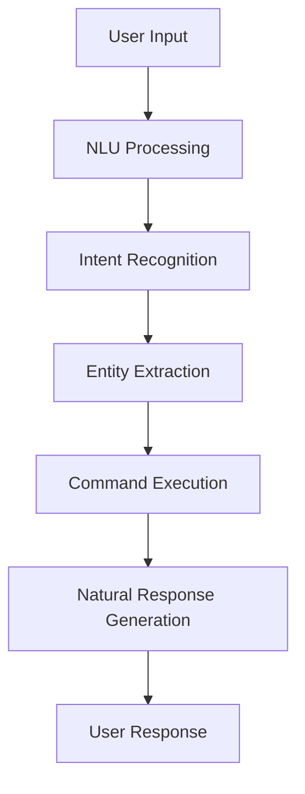
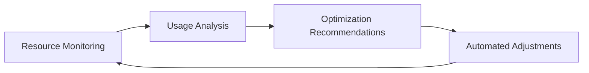

# Features

## Overview

This document provides detailed information about the features of TESSA (The Extremely Simple System Assistant), your intelligent assistant for managing Proxmox environments. TESSA is designed to make complex virtualization tasks accessible to users of all technical backgrounds.

## Core Features

### Natural Language Interface

TESSA allows you to interact with your Proxmox environment using natural language commands instead of complex command-line syntax.

- **Command Flexibility**: Issue commands in various ways - "start VM 100", "power on virtual machine 100", or "boot up the VM with ID 100" all work
- **Context Awareness**: TESSA remembers context from previous commands, so you can say "Start VM 100" followed by "Stop it" without repeating the VM ID
- **Conversational Interface**: Ask questions, get recommendations, and receive detailed explanations in plain language
- **Multi-platform Support**: Interact via web interface, CLI, or voice (where available)

### Automated Hardware Detection

TESSA simplifies hardware setup by automatically detecting and configuring components in your system.

- **Comprehensive Detection**: Identifies CPUs, RAM, storage devices, network interfaces, and specialized hardware
- **Compatibility Checks**: Verifies hardware against compatibility database and suggests alternatives for unsupported components
- **Driver Management**: Automatically installs required drivers for detected hardware
- **Performance Recommendations**: Suggests optimal configurations based on your detected hardware

### Simple Installation

TESSA features a streamlined installation process designed to minimize technical complexity.

- **Guided Setup**: Step-by-step installation wizard with clear instructions
- **Automated Configuration**: Intelligent defaults based on detected hardware and common use cases
- **Pre-installation Validation**: Checks system requirements before beginning installation
- **Recovery Options**: Built-in tools to recover from interrupted installations

### Goal-Based Setup

Rather than forcing users to translate their needs into technical specifications, TESSA allows you to express what you want to accomplish.

- **Use Case Templates**: Preconfigured setups for common scenarios like "Home Media Server" or "Development Environment"
- **Requirement Analysis**: TESSA asks about your needs and translates them into technical specifications
- **Progressive Disclosure**: Start with simple options, with advanced settings available when needed
- **Guided Configuration**: Step-by-step wizards for complex setups

### Visual Management

TESSA provides intuitive visual interfaces for managing your Proxmox environment.

- **Interactive Dashboard**: Real-time overview of system status and resource usage
- **Topology Visualization**: Visual representation of VMs, containers, networks, and storage
- **Resource Graphs**: Visual tracking of CPU, memory, disk, and network usage over time
- **Drag-and-Drop Interface**: Intuitively manage VM placement, resource allocation, and network configuration

### Progressive Learning Curve

TESSA adapts to your expertise level, providing more guidance for beginners and more advanced options for experienced users.

- **Adaptive Interface**: Changes complexity based on user experience and preference
- **Contextual Help**: Relevant guidance provided at each step without overwhelming documentation
- **Learning Path**: Gradually introduces more complex features as users become comfortable
- **Transferable Knowledge**: Helps users understand underlying concepts, not just TESSA-specific workflows

### Comprehensive Security

Security is built into every aspect of TESSA, protecting your environment while maintaining usability.

- **Security by Default**: Secure configurations applied automatically
- **Access Control**: Granular permission system for multi-user environments
- **Vulnerability Management**: Automated scanning and patching of security vulnerabilities
- **Audit Logging**: Comprehensive logging of system activities and changes
- **Encryption**: Built-in encryption for sensitive data and communications

## Advanced Features

### Service Catalog

TESSA provides a curated catalog of services that can be easily deployed in your environment.

- **One-Click Deployments**: Deploy common services like web servers, databases, and applications with minimal configuration
- **Dependency Management**: Automatically handles service dependencies and requirements
- **Configuration Templates**: Pre-configured templates for optimal performance and security
- **Service Health Monitoring**: Continuous monitoring and alerting for deployed services

### Resource Optimization

TESSA actively works to optimize resource usage across your environment.

- **Resource Balancing**: Distributes workloads optimally across available hardware
- **Usage Analysis**: Identifies underutilized or overcommitted resources
- **Predictive Scaling**: Anticipates resource needs based on historical patterns
- **Power Management**: Reduces energy consumption by optimizing resource allocation

### Backup and Disaster Recovery

TESSA provides comprehensive backup and recovery capabilities to protect your data.

- **Automated Backups**: Schedule regular backups of VMs and containers
- **Incremental Backups**: Space-efficient backup strategy that only stores changes
- **Flexible Retention**: Configure retention policies based on your needs
- **One-Click Restore**: Easily restore VMs, containers, or individual files from backups

### Plugin System

Extend TESSA's capabilities through a flexible plugin system.

- **Community Plugins**: Access community-developed extensions
- **Custom Integration**: Create your own plugins for specialized needs
- **API Access**: Integrate TESSA with other systems and services
- **Modular Architecture**: Add capabilities without affecting core functionality

## User Experience Features

### Voice Interaction

TESSA offers voice-based interaction for hands-free operation (where supported).

- **Natural Speech Recognition**: Understand spoken commands and questions
- **Voice Response**: Provide spoken feedback and information
- **Voice Profiles**: Adapt to different users' voices and speaking styles
- **Ambient Mode**: Optional always-listening mode for quick interactions

### Personalization

TESSA adapts to your preferences and usage patterns over time.

- **User Profiles**: Store preferences and settings for different users
- **Usage Pattern Learning**: Adapt suggestions based on your common tasks
- **Customizable Interface**: Arrange and prioritize information based on your needs
- **Favorite Commands**: Quick access to your most frequently used operations

### Ease of Use Features

- **Multi-language Support**: Interface available in multiple languages
- **Dark/Light Mode**: Visual themes for different environments and preferences
- **Accessibility Features**: Screen reader support, keyboard navigation, and other accessibility options
- **Mobile Responsive**: Access TESSA from mobile devices with an optimized interface

## Integration Features

### External System Integration

TESSA can integrate with external systems and services.

- **Cloud Provider Integration**: Connect with AWS, Azure, GCP for hybrid deployments
- **Authentication Systems**: Integrate with LDAP, OAuth, or other authentication providers
- **Monitoring Integration**: Connect with Grafana, Prometheus, and other monitoring tools
- **DNS Management**: Automatic DNS configuration with providers like Cloudflare

### Network Management

Comprehensive networking capabilities for complex environments.

- **Firewall Management**: Configure and manage firewall rules
- **VLAN Support**: Create and manage VLANs for network segmentation
- **VPN Integration**: Set up and manage VPN connections
- **Load Balancing**: Distribute traffic across multiple VMs or containers

## Hardware Compatibility

TESSA includes extensive hardware compatibility features.

- **Compatibility Database**: Regularly updated database of compatible hardware
- **Alternative Recommendations**: Suggestions for alternatives when incompatible hardware is detected
- **Custom Driver Support**: Integration of proprietary drivers when needed
- **Performance Profiling**: Optimizations specific to your hardware configuration

## Documentation and Support

TESSA provides comprehensive built-in documentation and support.

- **Contextual Help**: Relevant documentation accessible from wherever you are in the interface
- **Interactive Tutorials**: Guided walkthroughs of common tasks
- **Troubleshooting Wizards**: Step-by-step problem resolution
- **Community Knowledge Base**: Access to community solutions and recommendations
