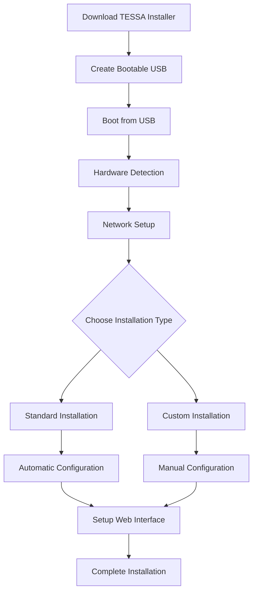
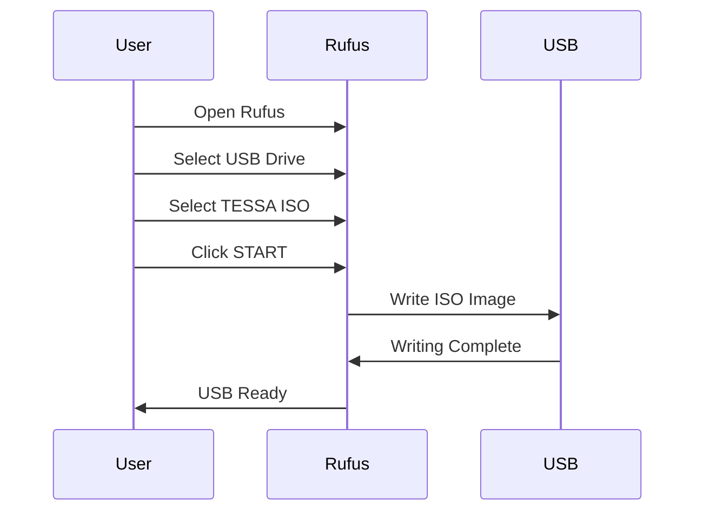
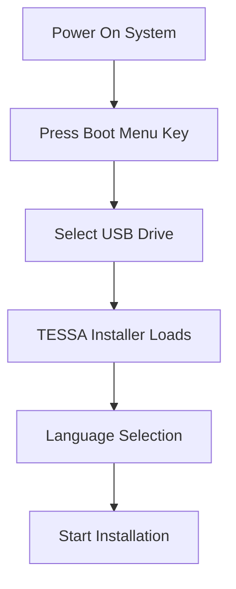
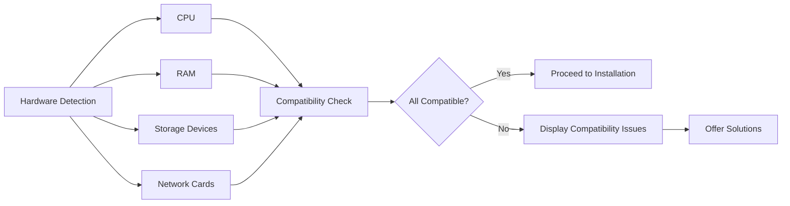
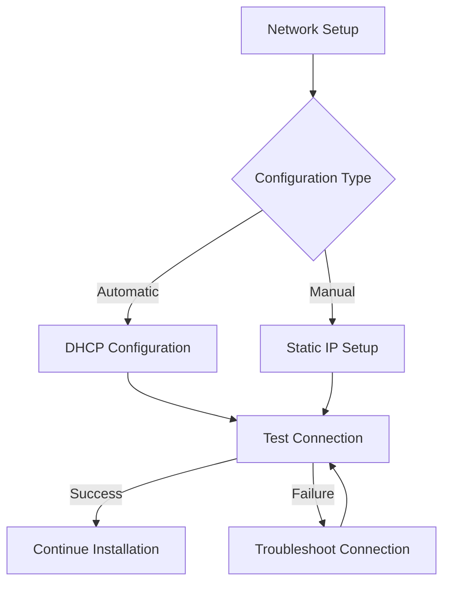
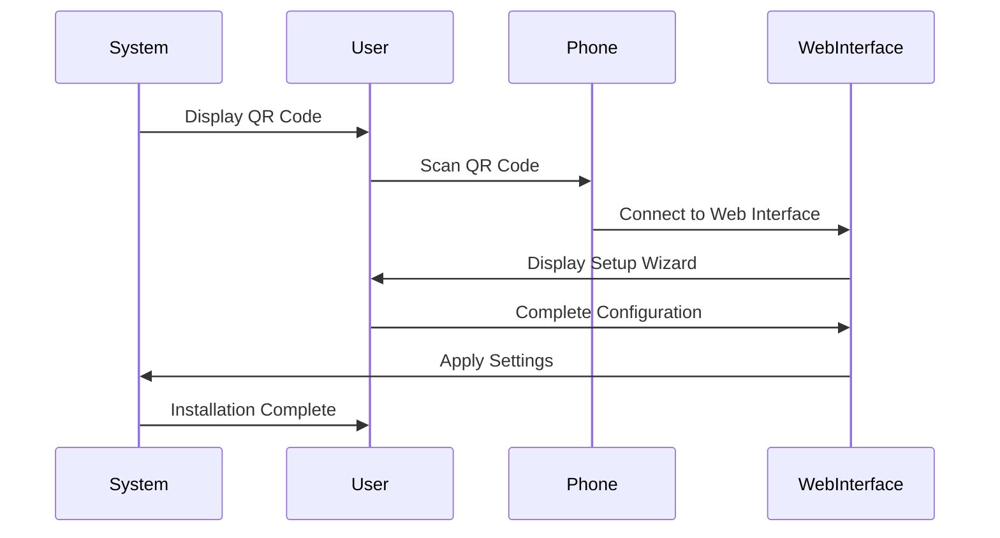

# Setup Guide

## Overview

This document provides a beginner-friendly setup guide for TESSA (The Extremely Simple System Assistant), including visual aids using Mermaid diagrams.

## System Requirements

Before beginning installation, ensure your system meets the following requirements:

- **CPU**: 64-bit dual-core processor (quad-core recommended)
- **RAM**: Minimum 4GB (8GB or more recommended)
- **Storage**: 32GB minimum (SSD recommended)
- **Network**: Ethernet connection (required during installation)
- **USB Drive**: 8GB or larger (for bootable installation media)

## Installation Process

### 1. Download the TESSA Installer Image

1. Visit [tessa-project.org/downloads](https://tessa-project.org/downloads)
2. Select the latest stable version
3. Download the ISO image (approximately 1.2GB)
4. Verify the checksum (instructions provided on the download page)

### 2. Create a Bootable USB Drive

#### Using Rufus (Windows)

1. Download Rufus from [rufus.ie](https://rufus.ie)
2. Insert your USB drive (8GB minimum)
3. Open Rufus and select your USB drive
4. Click SELECT and choose the TESSA ISO
5. Click START and wait for the process to complete

#### Using Etcher (Cross-Platform)

1. Download Etcher from [balena.io/etcher](https://balena.io/etcher)
2. Insert your USB drive (8GB minimum)
3. Open Etcher
4. Select the TESSA ISO file
5. Select your USB drive
6. Click "Flash!" and wait for completion

### 3. Boot Your Target System from the USB Drive

1. Insert the bootable USB drive into your target system
2. Power on the system
3. Enter the boot menu (typically by pressing F12, F11, or DEL during startup)
4. Select the USB drive as the boot device
5. Wait for the TESSA installer to load

### 4. Follow the On-Screen Instructions

The TESSA installer will guide you through the following steps:

#### Hardware Detection

TESSA will automatically detect your hardware components and verify compatibility. Any issues will be flagged with suggestions for resolution.

#### Network Configuration

1. Choose between automatic (DHCP) or manual network configuration
2. For manual setup, enter the following:
   - IP address
   - Subnet mask
   - Gateway
   - DNS servers

#### Storage Configuration

1. Select the target drive(s) for installation
2. Choose storage layout:
   - Standard (single disk)
   - RAID 1 (mirrored, requires 2 drives)
   - ZFS (advanced options)
3. Review and confirm storage configuration

### 5. Web Interface Setup

After the core installation is complete, TESSA will display a QR code and URL for accessing the web setup interface.

1. Scan the QR code using your smartphone or tablet
2. Alternatively, enter the displayed URL in any web browser on your network
3. The web interface will guide you through:
   - Creating your administrator account
   - Setting up security preferences
   - Configuring your first virtual machines
   - Setting up backup schedules

## Post-Installation

After installation is complete, you can:

1. Access TESSA via:
   - Web interface (https://your-server-ip:8006)
   - Mobile app
   - Voice interface
2. Run the Getting Started wizard for a guided tour of TESSA's features
3. Set up your first virtual machine using the VM wizard

## Troubleshooting

If you encounter issues during installation:

1. Check the compatibility report in the installer
2. Visit [tessa-project.org/troubleshooting](https://tessa-project.org/troubleshooting)
3. Join our community forum at [community.tessa-project.org](https://community.tessa-project.org)

## Video Tutorials

For visual step-by-step guidance, check out our video tutorials:
- [Complete Installation Guide](https://tessa-project.org/videos/installation)
- [Network Configuration](https://tessa-project.org/videos/network)
- [Storage Setup](https://tessa-project.org/videos/storage)
